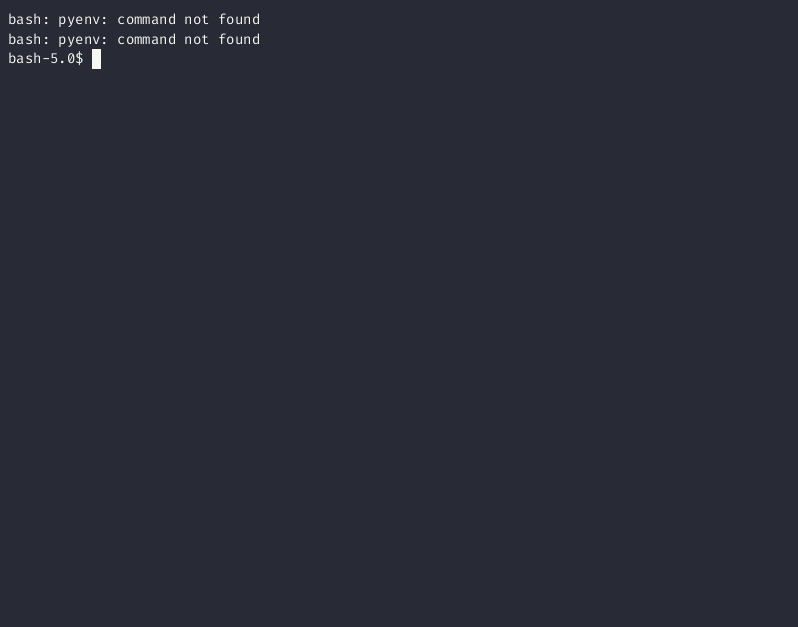

# RN - Rename Utility Built With [Tview](https://github.com/rivo/tview)

I built this to help me rename large amounts of files on my server. It allows you to:

- Rename multiple files at once with a find and replace feature (regex coming soon)
- Navigate directories with an interactive tree view
- Rename and delete directories and single files using a form

